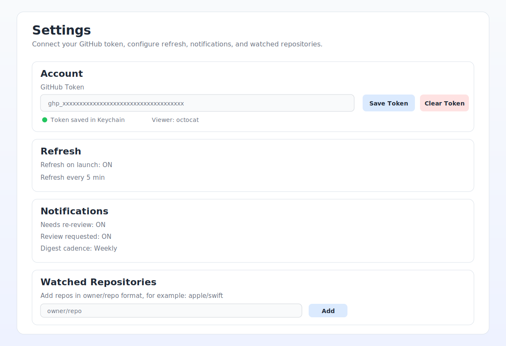
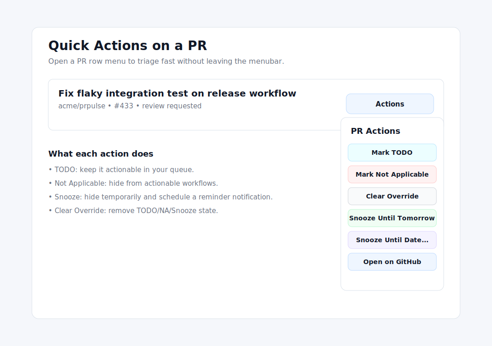

# PR Pulse

PR Pulse is a macOS menubar app for tracking pull requests that matter to you.

It helps you monitor:
- PRs authored by you
- PRs requesting your review
- PRs in watched repositories

It also supports triage actions, snoozing, notifications, and digest snapshots.

## Screenshots

### Dashboard Overview


### Settings and Token Setup



### Quick Actions



## Requirements

- macOS 13+
- GitHub token with read access to pull requests
- For building from source: Xcode 15+ (or Swift toolchain compatible with the package)

## Quick Start (Prebuilt Binary)

If your repo publishes binaries to GHCR (`ghcr.io`), you can run PR Pulse without Xcode.

1. Install [ORAS](https://oras.land/docs/installation).
2. Authenticate to GHCR (`read:packages` required):

```bash
echo <github_pat> | oras login ghcr.io -u <github_username> --password-stdin
```

3. Pull latest archive:

```bash
oras pull ghcr.io/<owner>/prpulse-app:latest
```

4. Unpack and run:

```bash
tar -xzf PRPulseApp-macos-<commit-sha>.tar.gz
open PRPulseApp.app
```

## Build and Run from Source

```bash
git clone <your-repo-url>
cd PRPulse
swift build -c release --product PRPulseApp
./scripts/install_prpulse.sh
open "$HOME/Applications/PRPulseApp.app"
```

Or open in Xcode and run the `PRPulseApp` scheme on `My Mac`.

## GitHub Token Setup

PR Pulse requires a GitHub Personal Access Token (PAT).

### Option A: Fine-grained token (recommended)

1. Open <https://github.com/settings/tokens?type=beta>
2. Create a new fine-grained token.
3. Grant repository read access for repositories you want to monitor.
4. Minimum repository permissions:
   - `Metadata: Read`
   - `Pull requests: Read`
5. If private org repos are involved, include needed org-level read permissions.

### Option B: Classic token

1. Open <https://github.com/settings/tokens>
2. Create a classic token with:
   - `repo`
   - `read:org` (when needed for org/private visibility)

## First-Time App Setup

1. Launch PR Pulse.
2. Open `Settings`.
3. In `Account`, paste your token into `GitHub Token`.
4. Click `Save Token`.
5. Verify:
   - status dot turns green
   - `Viewer` shows your GitHub username
6. Click `Refresh Now` in `Debug`.

Token storage:
- Tokens are stored in macOS Keychain.
- Token values are not persisted in plaintext settings files.

## How to Use PR Pulse

### 1. Choose a Tab

- `My PRs`: open PRs authored by you
- `Review Requested`: open PRs where your review is requested
- `Watched`: open PRs from repos you add in settings

### 2. Filter the List

Use search + toggles to focus on what is actionable:
- search by title/repository
- actionable-only
- hide reviewed
- hide snoozed
- hide not applicable

### 3. Triage Quickly

Use row quick actions:
- `Mark TODO`
- `Mark Not Applicable`
- `Clear Override`
- `Snooze Until Tomorrow`
- `Snooze Until Date...`
- `Open on GitHub`

### 4. Configure Watchlist

In `Settings` -> `Watched repositories`:
- add repos in `owner/repo` format (example: `apple/swift`)
- toggle per-repo notifications

### 5. Use Notifications and Digest

In `Settings` -> `Notifications`:
- enable re-review and review-request notifications
- pick digest cadence: `Off`, `Weekly`, `Bi-Weekly`

## Real Data vs Mock Data

- Production/default app behavior uses real GitHub API data.
- Mock data is test-only.
- To explicitly force mock mode for local testing:

```bash
PRPULSE_USE_MOCK_CLIENT=1 ./PRPulseApp
```

## Troubleshooting

### Viewer stays `me` or PR list is empty

- Token may be missing/invalid.
- Token may not have sufficient repository/org read permissions.
- Repo might not be accessible by your token.

### Watched tab is empty

- Add at least one watched repo (`owner/repo`).
- Confirm token can read that repository.

### Notifications not showing

- Check macOS notification permissions for the app.
- Ensure notification toggles are enabled in settings.

### Build issues on local CLI toolchain

If `swift test` or `swift build` fails with toolchain/sandbox cache issues, running from Xcode or using a matching toolchain usually resolves it.

## Debug Tools (Settings -> Debug)

- `Refresh Now`
- `Force Digest Recompute`
- `Open settings.json`
- `Copy viewer login`
- `Test Notification`
- `Export logs`

## Security Notes

- GitHub token is stored in Keychain.
- Token values are never persisted in plaintext app settings.
- Treat your PAT as a password and rotate it periodically.

---

If you are publishing this app externally, keep this README and screenshot folder in sync with UI and behavior changes.
